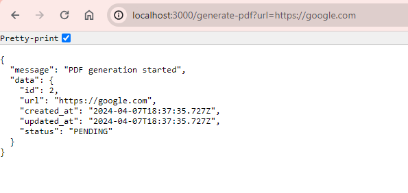
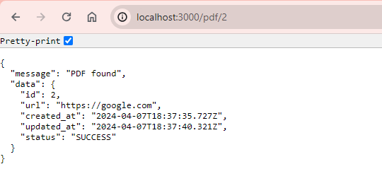

# URL to PDF file

## Getting Started

1. Install dependencies

```bash
npm install
```

2. Build the project

```bash
npm run build
```

3. Migrate the database

```bash
npm run migrate
```

4. Run the project

```bash
npm start
```

## API Reference

### GET /generate-pdf?url={url}

Generate a PDF file from a given URL

#### Parameters

- `url` - URL of the page to generate PDF from

### GET /pdf/:id

Get a PDF file by ID

#### Parameters

- `id` - ID of the PDF file

### GET /pdf/:id/download

Download a PDF file by ID

#### Parameters

- `id` - ID of the PDF file

## Tingkat Kesulitan

Service ini dibuat menggunakan Sqilite, Express, dan Puppeteer. User melakukan request ke service ini dengan memberikan URL yang ingin dijadikan PDF. Service ini akan mengambil URL tersebut, kemudian menggunakan Puppeteer untuk mengambil screenshot dari URL tersebut. Setelah itu, service ini akan menyimpan screenshot tersebut ke dalam database dan memberikan ID dari screenshot tersebut kepada user. User dapat mengakses PDF tersebut dengan menggunakan ID yang diberikan.

## Keunikan

Service ini memiliki beberapa keunikan, yaitu:

- Service ini menggunakan Sqilite sebagai database, sehingga service ini dapat dijalankan tanpa perlu menginstall database server.
- Service ini menggunakan Puppeteer untuk mengambil screenshot dari URL yang diberikan oleh user.
- Service ini menyimpan screenshot yang diambil oleh Puppeteer ke dalam database, sehingga user dapat mengakses PDF tersebut dengan menggunakan ID yang diberikan.

## Screenshots

### Generate PDF



### Get PDF



## License

This project is licensed under the MIT License.
